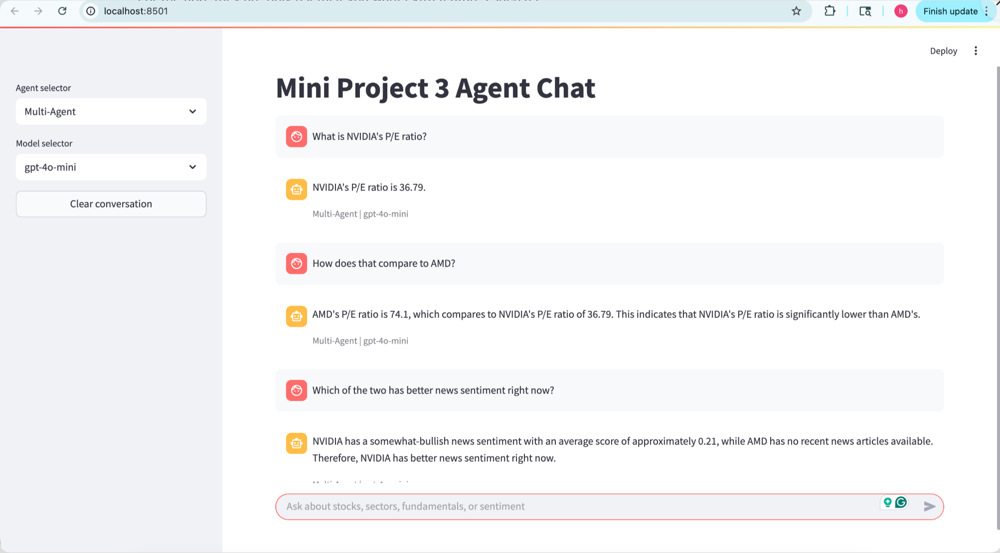
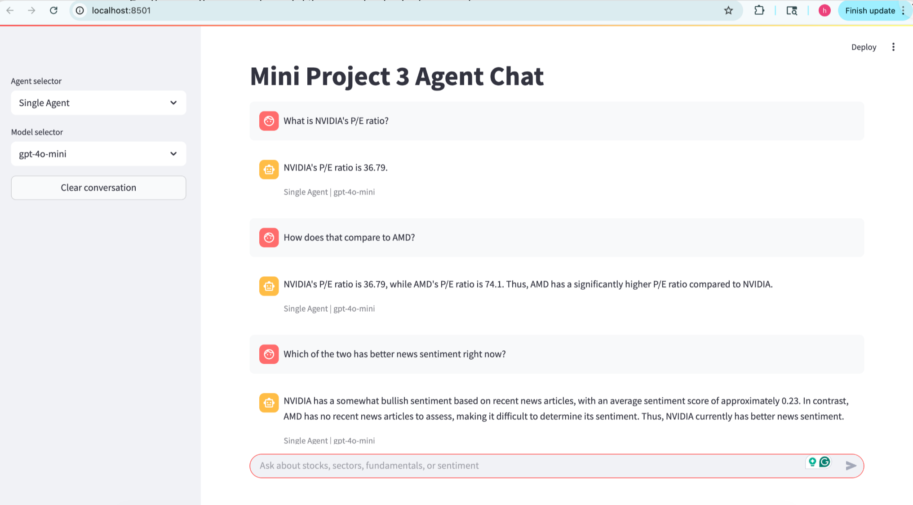
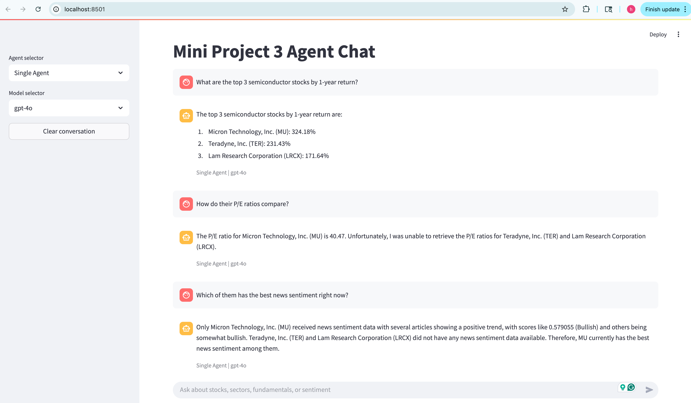
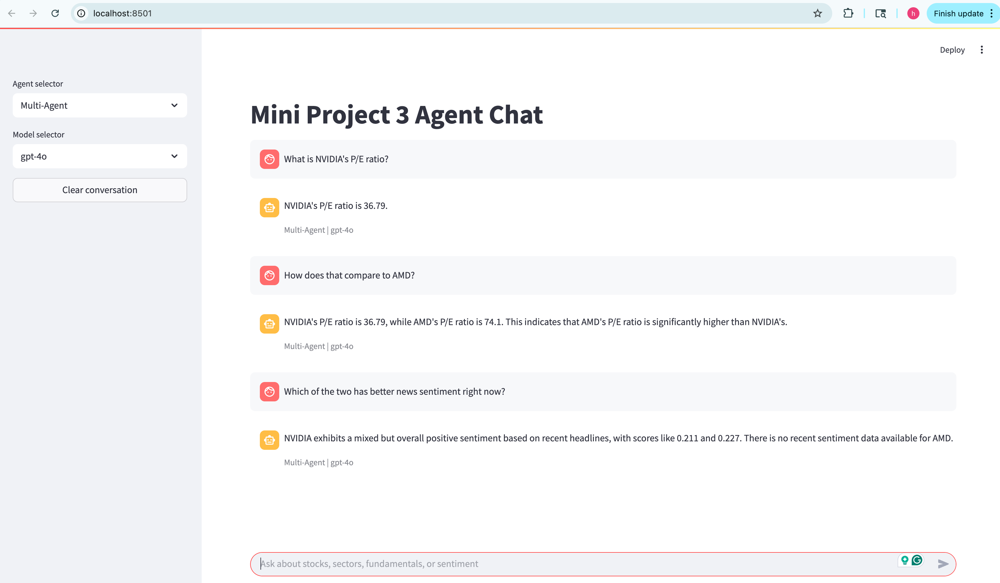
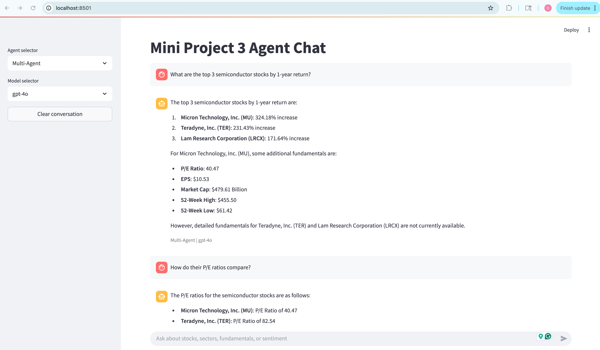
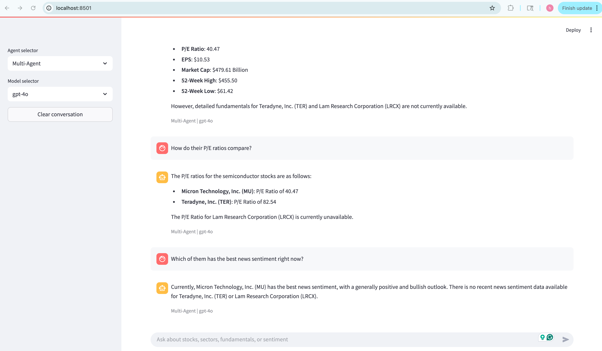

# Mini Project 3: Multi-Agent Financial Chat — Screenshot Documentation

This document presents screenshots from the deployed Streamlit application, demonstrating both agent architectures (Single Agent and Multi-Agent) with two model backends (gpt-4o-mini and gpt-4o). Each screenshot shows a complete 3-turn conversation where follow-up questions are correctly resolved using conversational context.

---

### Screenshot 1: Multi-Agent | gpt-4o-mini

*Three-turn conversation (NVIDIA vs AMD): P/E ratio lookup, comparison, and news sentiment analysis.*

---

### Screenshot 2: Single Agent | gpt-4o-mini

*Same three-turn conversation using the single-agent architecture.*

---

### Screenshot 3: Single Agent | gpt-4o

*Three-turn conversation (NVIDIA vs AMD) with gpt-4o.*

---

### Screenshot 4: Multi-Agent | gpt-4o

*Same NVIDIA vs AMD conversation using the multi-agent architecture with gpt-4o.*

---

### Screenshot 5: Single Agent | gpt-4o (Semiconductor Sector)

*Three-turn conversation: top semiconductor stocks by 1-year return, P/E comparison, and best news sentiment.*

---

### Screenshot 6: Multi-Agent | gpt-4o (Semiconductor Sector, Page 1)

*Multi-agent version of the semiconductor query with additional fundamentals retrieved.*

---

### Screenshot 7: Multi-Agent | gpt-4o (Semiconductor Sector, Page 2)

*Continuation: P/E ratio comparison and news sentiment results.*

